# Project 10 - Kubernetes Deployment Platform

This project is a local Kubernetes deployment of a small frontend + backend + PostgreSQL application.

I built it after working with EC2, ECR, GitHub Actions, and ECS Fargate, because I wanted to understand the basic Kubernetes workflow before jumping directly into AWS EKS.

The goal was not to make a huge production system. The goal was to understand the main Kubernetes objects properly and have a working project that I can explain.

## What the app does

The app has three main parts:

- A frontend served by Nginx
- A backend API built with FastAPI
- A PostgreSQL database

The frontend can call the backend through /api, and the backend stores tasks in PostgreSQL.

I tested it by adding a task from the browser and then checking that it was returned from the API.

## Architecture

```text
Browser
  ↓
localhost:8081
  ↓
Kubernetes Ingress
  ↓
Frontend Service
  ↓
Frontend Pod

/api requests:
Browser
  ↓
Ingress
  ↓
Backend Service
  ↓
Backend Pod
  ↓
PostgreSQL Service
  ↓
PostgreSQL Pod
  ↓
PersistentVolumeClaim
```

## Tools used

- Kubernetes
- kind
- kubectl
- Docker
- Nginx
- FastAPI
- PostgreSQL
- Helm
- GitHub Actions
- WSL Ubuntu

## What I built

This project includes:

- A local Kubernetes cluster using kind
- Frontend and backend Docker images
- Kubernetes manifests for the app
- Namespace
- ConfigMap
- Secret
- Deployments
- Services
- Ingress
- PersistentVolumeClaim
- Readiness and liveness probes
- Helm chart
- Helm upgrade test
- GitHub Actions validation workflow

## Project structure

```text
project10-kubernetes-deployment-platform/
├── backend/
│   ├── Dockerfile
│   ├── requirements.txt
│   └── app/
│       ├── __init__.py
│       └── main.py
├── frontend/
│   ├── Dockerfile
│   └── index.html
├── k8s/
│   ├── namespace.yaml
│   ├── configmap.yaml
│   ├── secret.yaml
│   ├── postgres-pvc.yaml
│   ├── postgres-deployment.yaml
│   ├── postgres-service.yaml
│   ├── backend-deployment.yaml
│   ├── backend-service.yaml
│   ├── frontend-deployment.yaml
│   ├── frontend-service.yaml
│   └── ingress.yaml
├── helm/
│   └── project10/
│       ├── Chart.yaml
│       ├── values.yaml
│       └── templates/
├── screenshots/
├── kind-config.yaml
└── README.md
```

## Running the project locally

Create the kind cluster:

```bash
kind create cluster --config kind-config.yaml
```

Check that the cluster is running:

```bash
kubectl get nodes
```

Build the Docker images:

```bash
docker build -t project10-backend:latest ./backend
docker build -t project10-frontend:latest ./frontend
```

Load the images into the kind cluster:

```bash
kind load docker-image project10-backend:latest --name project10
kind load docker-image project10-frontend:latest --name project10
```

Apply the Kubernetes files:

```bash
kubectl apply -f k8s/
```

Check the pods and services:

```bash
kubectl get pods -n project10
kubectl get svc -n project10
kubectl get ingress -n project10
```

Test the backend through Ingress:

```bash
curl http://localhost:8081/api/health
```

Expected result:

```json
{"status":"healthy","database":"connected"}
```

The app can also be opened in the browser:

```text
http://localhost:8081
```

## Helm

After the normal Kubernetes YAML deployment worked, I also created a Helm chart for the same app.

Install with Helm:

```bash
helm install project10 ./helm/project10 --namespace project10 --create-namespace
```

Check the Helm release:

```bash
helm list -n project10
```

I also tested a Helm upgrade by scaling the frontend from 1 pod to 2 pods:

```bash
helm upgrade project10 ./helm/project10 -n project10 --set frontend.replicas=2
```

Then I checked the pods:

```bash
kubectl get pods -n project10
```

This showed two frontend pods running, which confirmed the Helm upgrade worked.

## GitHub Actions

I added a GitHub Actions workflow for validation.

The workflow:

- Installs Helm
- Installs kubectl
- Installs kind
- Creates a temporary Kubernetes cluster
- Runs helm lint
- Renders the Helm templates
- Runs Kubernetes dry-run validation
- Runs Helm dry-run install

Workflow file:

```text
.github/workflows/project10-kubernetes-validation.yml
```

The first version of the workflow failed because GitHub Actions did not have a Kubernetes cluster available. I fixed it by creating a temporary kind cluster inside the workflow.

## Screenshots

### Docker images built

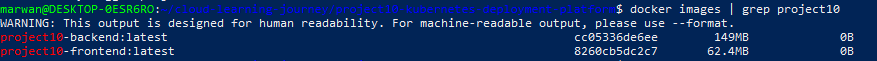

### Ingress created

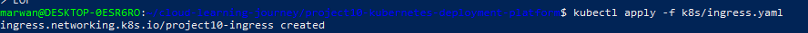

### API health through Ingress

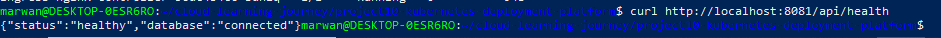

### App running in browser

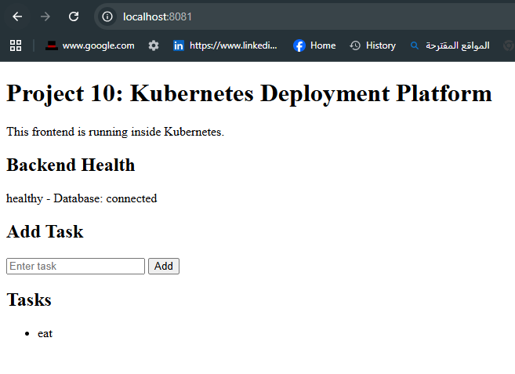

### API tasks through Ingress

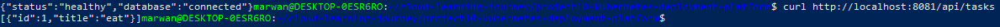

### Backend logs

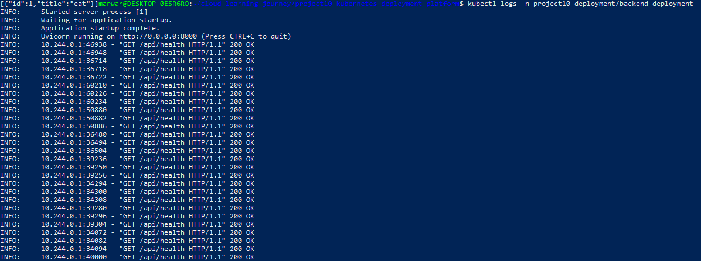

### Backend pod describe and probes

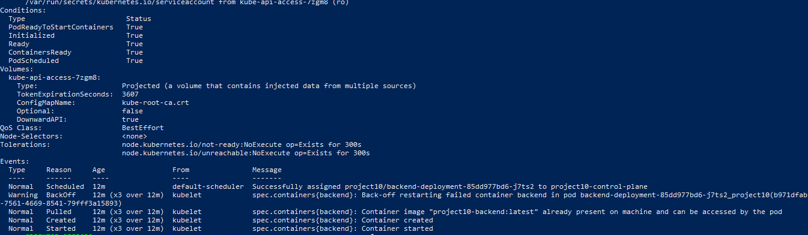

### Kubernetes resources running

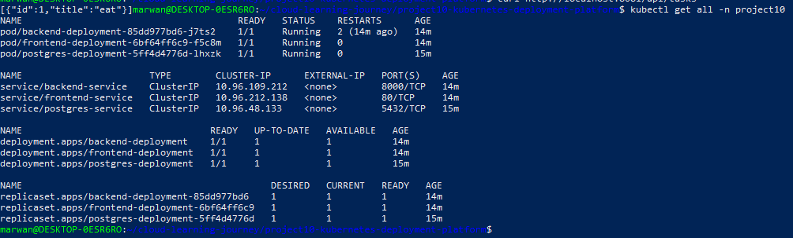

### Helm upgrade success

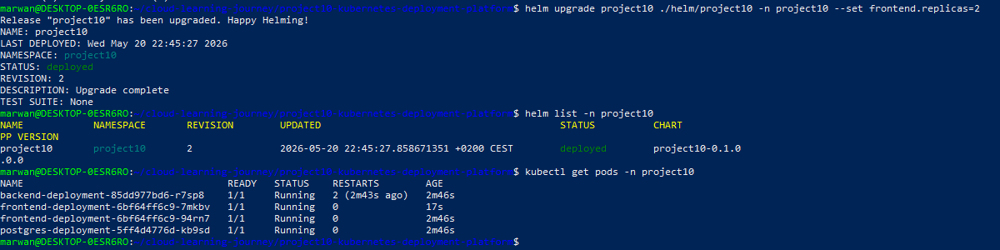

### GitHub Actions failed before fix

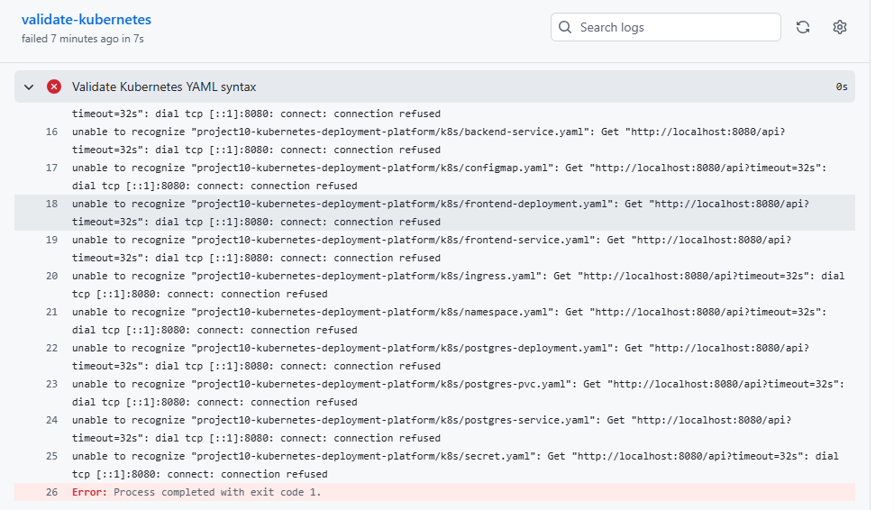

### GitHub Actions validation success

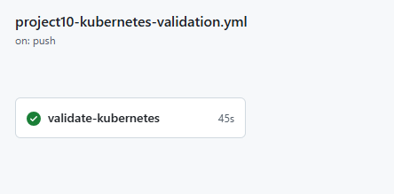

## Problems I ran into

### kubectl was missing

At the start, kubectl was not installed in WSL, so I installed it first.

### kind was missing

kind was also not installed, so I installed the Linux binary manually.

### I accidentally broke the frontend file

While creating files from the terminal, I accidentally pasted Dockerfile content into index.html. I fixed it by overwriting the frontend files cleanly and rebuilding the image.

### Some Kubernetes resources failed the first time

When I first ran kubectl apply -f k8s/, some resources failed because the namespace had just been created. Running the apply command again fixed it.

### Backend restarted before PostgreSQL was ready

The backend restarted a few times because PostgreSQL was still starting. After the database became ready, the backend connected successfully and stayed running.

### GitHub Actions failed the first time

The first GitHub Actions validation failed because there was no Kubernetes cluster in the GitHub runner. I fixed this by making the workflow create a temporary kind cluster before running validation.

## What I learned

This project helped me understand the basic Kubernetes workflow much better.

The main things I practiced were:

- Pods are where containers actually run
- Deployments keep the desired number of pods running
- Services give stable networking to pods
- Ingress routes HTTP traffic into the cluster
- ConfigMaps are for normal configuration
- Secrets are for sensitive values
- PVCs are used for persistent storage
- Readiness probes control when a pod receives traffic
- Liveness probes help Kubernetes restart unhealthy containers
- Helm makes Kubernetes YAML easier to reuse and upgrade
- GitHub Actions can validate Kubernetes configs before merging changes

## Future improvements

Things I could add later:

- Deploy the same app to AWS EKS
- Push images to Amazon ECR
- Use AWS Load Balancer Controller
- Add HTTPS
- Add backend tests
- Add separate dev and prod Helm values
- Add monitoring
- Replace local PostgreSQL with RDS in the cloud version

## Summary

This project was my first proper Kubernetes deployment project.

It runs a frontend, backend, and PostgreSQL database inside a local kind cluster. It also includes Ingress routing, health probes, persistent storage, Helm deployment, Helm upgrade, and GitHub Actions validation.
