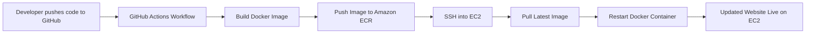
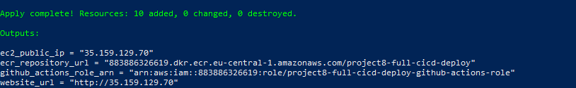
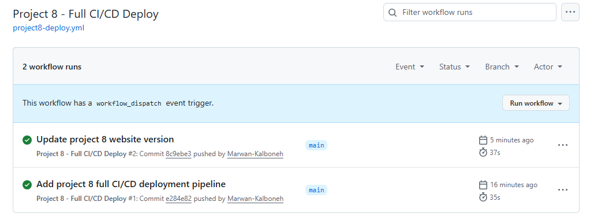
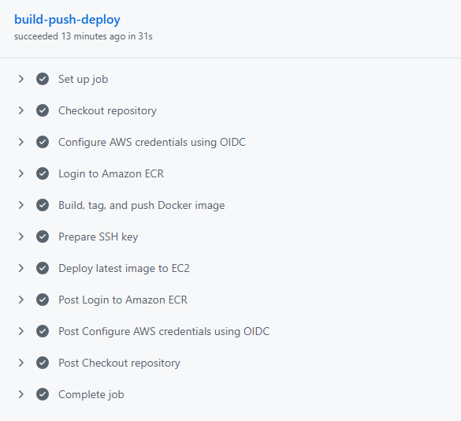
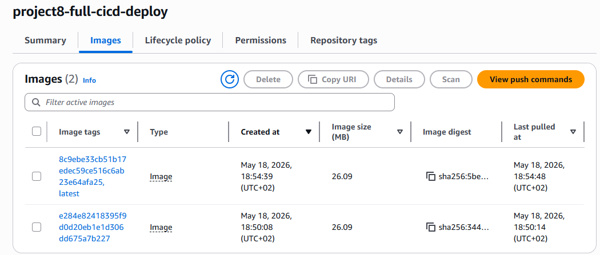
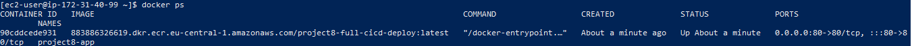
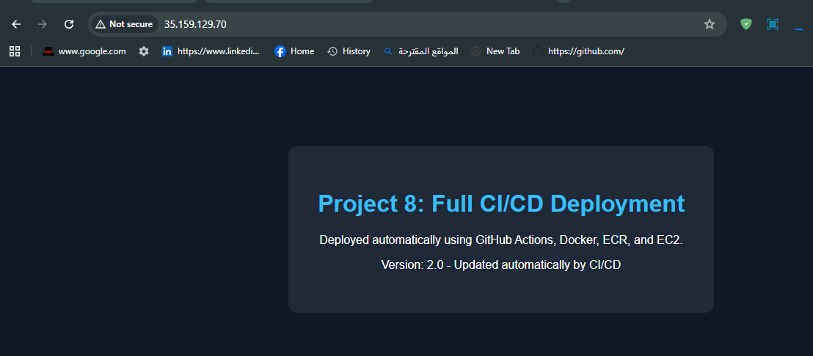
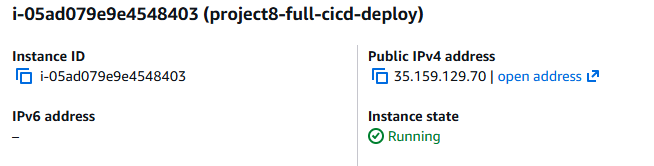
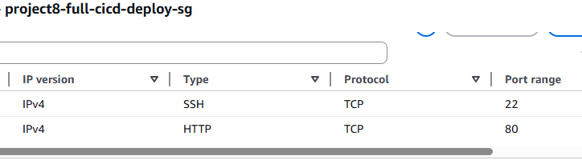

# Project 8 - Full CI/CD Deployment Pipeline

This project demonstrates a complete CI/CD deployment pipeline for a Dockerized web application on AWS.

The main goal was to automate the full deployment flow:

```text
GitHub Push → GitHub Actions → Docker Build → Amazon ECR → EC2 Auto Deploy
```

## Architecture



## Technologies Used

- AWS EC2
- Amazon ECR
- Terraform
- Docker
- GitHub Actions
- IAM Roles
- GitHub OIDC Authentication
- SSH Deployment
- Linux / Amazon Linux 2023

## What This Project Does

Terraform creates the cloud infrastructure, including:

- EC2 instance
- Security group for SSH and HTTP
- ECR repository
- IAM role for EC2 to pull from ECR
- IAM role for GitHub Actions using OIDC

GitHub Actions handles the CI/CD pipeline:

1. Checks out the repository
2. Authenticates to AWS using OIDC
3. Logs in to Amazon ECR
4. Builds the Docker image
5. Pushes the image to ECR
6. SSHs into the EC2 instance
7. Pulls the latest image
8. Stops and removes the old container
9. Starts the updated container

## Deployment Flow

When I update the website code and push to the main branch, GitHub Actions automatically rebuilds and redeploys the application.

This means I do not need to manually SSH into the server every time I want to update the website.

## Screenshots

### Terraform Apply Success



### GitHub Actions Success



### GitHub Actions Pipeline Steps



### Docker Image Pushed to ECR



### Docker Container Running on EC2



### Website Version 1.0


### Website Updated Automatically After CI/CD



### EC2 Instance Running



### Security Group Rules



## Key Things I Learned

- How to connect GitHub Actions to AWS without long term AWS access keys using OIDC
- How Docker images are built, tagged, and pushed to Amazon ECR
- How EC2 can pull and run images from a private ECR repository
- How SSH can be used inside a deployment pipeline
- How Terraform can create repeatable cloud infrastructure
- How CI CD connects code changes to real infrastructure updates
- Why .terraform, .tfstate, provider binaries, and secrets should not be committed to GitHub

## Security Notes

- AWS credentials are not stored directly in GitHub.
- GitHub Actions uses OIDC to assume an IAM role.
- EC2 pulls images from ECR using an IAM instance role.
- SSH access is handled through a GitHub repository secret.
- Terraform state files and generated provider files are ignored by Git.

## Project Status

Completed.

The final test confirmed that changing the website from Version 1.0 to Version 2.0 triggered the GitHub Actions workflow and updated the live EC2 hosted website automatically.
