# Project 9 - Production-style ECS Fargate Deployment

This project is a production-style cloud deployment project built as part of my cloud/devops learning journey.

The goal was to move beyond simple EC2 deployments and build a more realistic container deployment workflow using AWS ECS Fargate, Terraform, Docker, Amazon ECR, Application Load Balancer, CloudWatch, and GitHub Actions.

The application started as a local multi-container Docker Compose setup, then was deployed to AWS ECS Fargate with automated CI/CD from GitHub.

---

## Project Status

Completed:

- Local multi-container application with Docker Compose
- Frontend container using Nginx
- Backend API container using FastAPI
- PostgreSQL database container for local development
- Amazon ECR repositories for frontend and backend images
- AWS ECS Fargate cluster
- Frontend ECS service
- Backend ECS service
- Application Load Balancer
- ALB path routing
- CloudWatch log groups
- GitHub Actions CI/CD pipeline
- GitHub OIDC authentication to AWS
- Automated ECS redeployment after code changes

---

## Final Architecture

```text
Developer pushes code to GitHub
        ↓
GitHub Actions workflow starts
        ↓
GitHub authenticates to AWS using OIDC
        ↓
Frontend Docker image is built
Backend Docker image is built
        ↓
Images are pushed to Amazon ECR
        ↓
GitHub Actions forces ECS service redeployment
        ↓
ECS Fargate pulls the latest images
        ↓
Frontend and backend tasks run on ECS
        ↓
Application Load Balancer routes traffic
        ↓
Public app is available through ALB DNS
```

---

## AWS Architecture

```text
Internet
   ↓
Application Load Balancer
   ↓
Path routing:
   /       → Frontend ECS service
   /api/*  → Backend ECS service
   ↓
ECS Fargate tasks
   ↓
CloudWatch Logs
```

For local development:

```text
Browser
   ↓
Nginx frontend container
   ↓
FastAPI backend container
   ↓
PostgreSQL database container
```

---

## Technologies Used

- AWS ECS Fargate
- Amazon ECR
- Application Load Balancer
- AWS IAM
- AWS OIDC
- AWS CloudWatch
- Terraform
- Docker
- Docker Compose
- GitHub Actions
- Nginx
- FastAPI
- PostgreSQL
- Python
- Git/GitHub

---

## What Terraform Creates

Terraform provisions the cloud infrastructure for the project, including:

- ECR repository for the frontend image
- ECR repository for the backend image
- VPC
- Public subnets
- Internet Gateway
- Route table
- Security groups
- ECS cluster
- ECS task execution role
- CloudWatch log groups
- Application Load Balancer
- Target groups
- ALB listener
- ALB listener rule for `/api/*`
- Frontend ECS task definition
- Backend ECS task definition
- Frontend ECS service
- Backend ECS service
- GitHub Actions IAM role
- GitHub Actions deployment policy

---

## CI/CD Pipeline

The GitHub Actions workflow automatically deploys the application.

On push to `main`, the workflow:

1. Checks out the repository
2. Authenticates to AWS using OIDC
3. Logs in to Amazon ECR
4. Builds the frontend Docker image
5. Pushes the frontend image to ECR
6. Builds the backend Docker image
7. Pushes the backend image to ECR
8. Forces a new ECS deployment for the frontend service
9. Forces a new ECS deployment for the backend service
10. Waits until both ECS services are stable

This means a code change can move from GitHub to a live ECS deployment automatically.

---

## Local Development

The app can be tested locally using Docker Compose.

Start the local environment:

```bash
docker compose up --build
```

Open:

```text
http://localhost:8080
```

Stop the environment:

```bash
docker compose down
```

Local services:

- Frontend: Nginx container
- Backend: FastAPI container
- Database: PostgreSQL container

---

## AWS Deployment

The AWS infrastructure is managed from the `terraform/` folder.

Initialize Terraform:

```bash
cd terraform
terraform init
```

Validate:

```bash
terraform validate
```

Apply:

```bash
terraform apply
```

Destroy when finished to avoid AWS costs:

```bash
terraform destroy
```

---

## Important Notes

The local version uses PostgreSQL through Docker Compose.

The AWS ECS version currently runs the backend in memory mode, without RDS. This was done intentionally to keep the first ECS deployment simpler and lower cost. The backend still exposes the same API endpoints, and the Application Load Balancer routes `/api/*` traffic to the backend ECS service.

A future improvement would be adding Amazon RDS PostgreSQL and connecting the backend ECS service to it through environment variables and private networking.

---

## Screenshots

### 1. Local app running

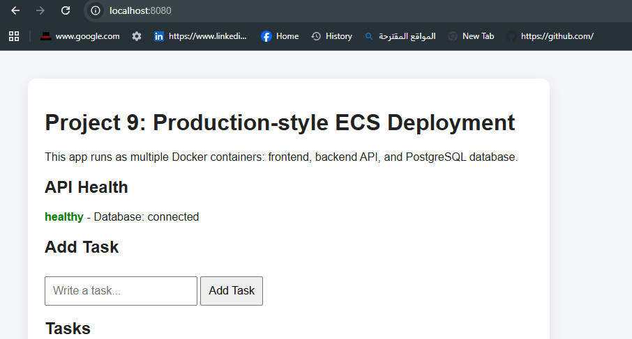

### 2. Local task added successfully

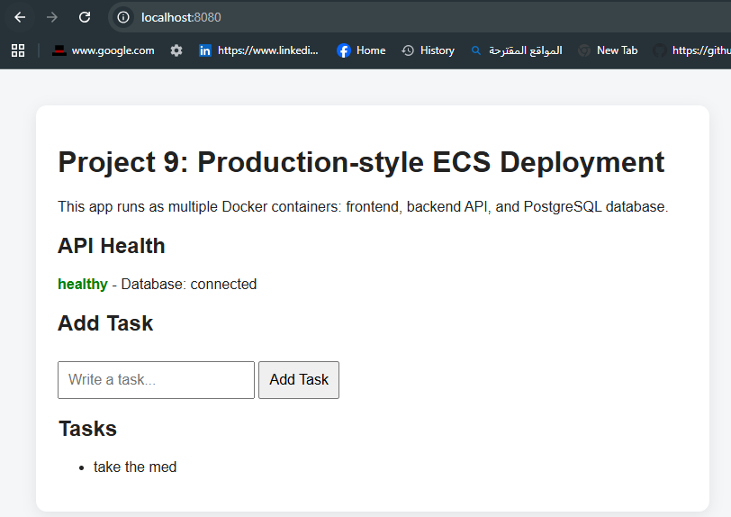

### 3. Local Docker containers running

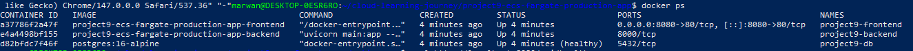

### 4. Local API health check

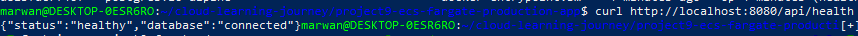

### 5. ECR repositories created

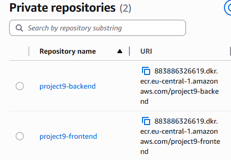

### 6. Images pushed to ECR

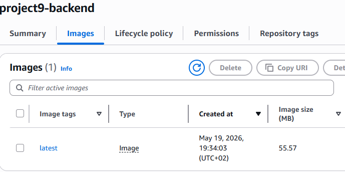

### 7. ECS networking infrastructure created

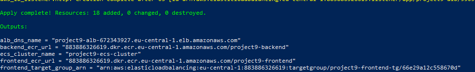

### 8. ECS services running

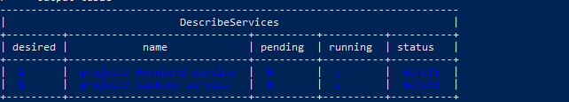

### 9. Backend service reached steady state

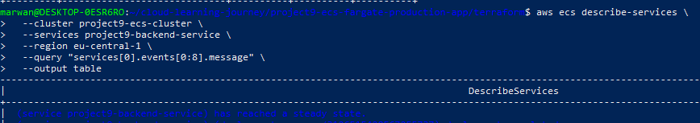

### 10. Full app healthy through ALB

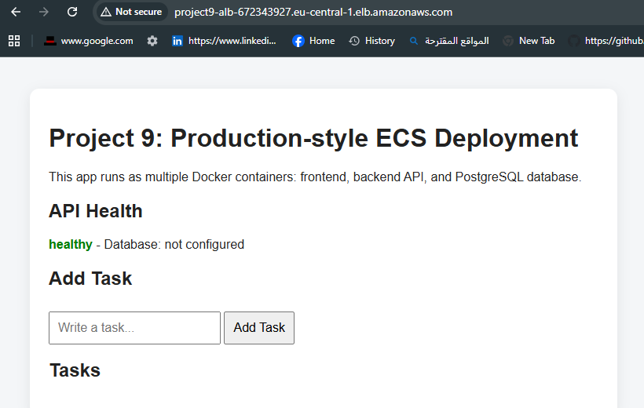

### 11. API health through ALB

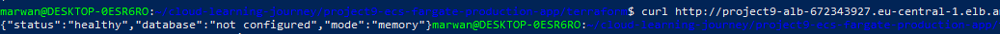

### 12. GitHub Actions CI/CD success

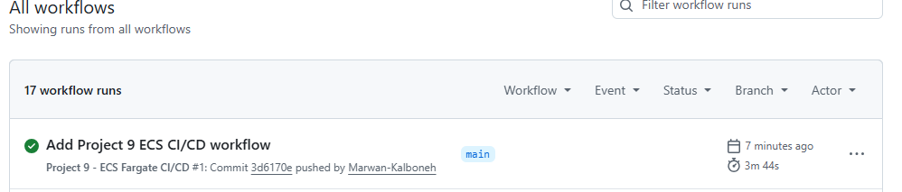

---

## Key Lessons Learned

This project helped me understand how a more realistic container deployment workflow works on AWS.

Main lessons:

- ECS Fargate can run containers without directly managing EC2 servers.
- ECR stores Docker images used by ECS task definitions.
- Application Load Balancer can route traffic to different ECS services.
- ALB listener rules can route `/api/*` traffic to the backend service.
- ECS services keep the desired number of tasks running.
- CloudWatch log groups collect logs from ECS containers.
- Terraform makes the infrastructure repeatable.
- GitHub Actions can automate image builds and ECS redeployment.
- OIDC allows GitHub Actions to access AWS without storing long-term AWS keys.
- Debugging failed ECS tasks requires checking task events, stopped reasons, and service events.

---

## Problems Faced and Fixed

During the project, I debugged several real issues:

- Docker Compose was missing/broken in WSL, so I installed the Compose v2 plugin manually.
- Docker permissions blocked non-sudo Docker commands, so I fixed user access to the Docker group.
- The first ECS frontend task failed because Nginx tried to resolve a backend container name that only existed in Docker Compose.
- The frontend configuration was adjusted for ECS so ALB handles `/api/*` routing instead.
- ECS task failures were debugged using ECS service events and stopped task details.
- GitHub Actions initially failed to configure AWS credentials, then the OIDC role/secret setup was corrected.
- Terraform state and generated files were excluded from Git to avoid committing sensitive or unnecessary files.

---

## Possible Future Improvements

Possible future upgrades:

- Add Amazon RDS PostgreSQL
- Move ECS tasks into private subnets
- Add NAT Gateway or VPC endpoints
- Add HTTPS with ACM certificate
- Add a custom domain using Route 53
- Add CloudWatch alarms
- Add separate dev/prod environments
- Use image tags based on Git commit SHA instead of only `latest`
- Add automated tests before deployment

---

## Project Summary

This project demonstrates a full container deployment workflow on AWS:

```text
Dockerized frontend and backend
→ Amazon ECR
→ ECS Fargate
→ Application Load Balancer
→ CloudWatch
→ GitHub Actions CI/CD
```

It is my strongest cloud/devops project so far because it combines infrastructure as code, containers, managed AWS services, load balancing, IAM/OIDC security, and automated deployment.
