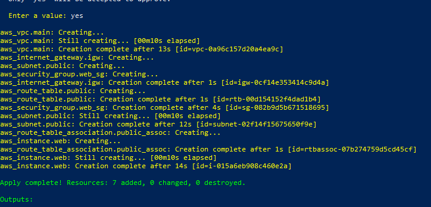
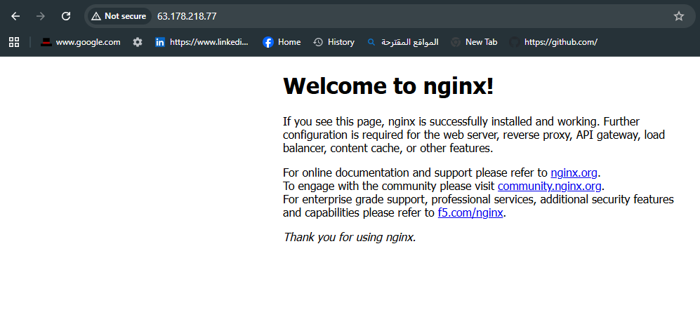
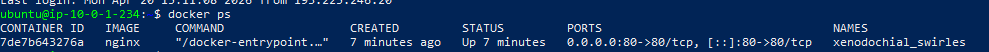
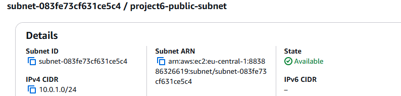
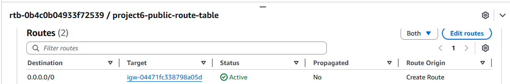

# Terraform AWS VPC + EC2 + Docker Nginx

## About
This project provisions a custom AWS VPC and deploys a Dockerized nginx web server on an EC2 instance using Terraform.

The goal of this project was to stop relying on the default AWS network and instead build the networking layer manually to better understand how public cloud infrastructure works.

## Architecture
VPC → Public Subnet → Internet Gateway → Route Table → EC2 → Docker → nginx

## What this project does
- Creates a custom AWS VPC
- Creates a public subnet inside that VPC
- Attaches an Internet Gateway
- Configures a route table for internet access
- Associates the route table with the public subnet
- Creates a security group for SSH and HTTP access
- Launches an EC2 instance in the public subnet
- Installs Docker automatically using `user_data`
- Runs an nginx container on port 80

## Files
- `main.tf` → main Terraform infrastructure resources
- `variables.tf` → input variables
- `terraform.tfvars` → actual values used for the deployment
- `outputs.tf` → public IP and DNS outputs
- `user_data.sh` → boot-time script to install Docker and run nginx

## Screenshots

### Terraform Apply


### Browser Result


### Docker Running on EC2


### Public Subnet


### Route Table


## What I learned
- How to create a custom VPC instead of using the default AWS network
- How a subnet becomes public
- Why an Internet Gateway is required for internet access
- How route tables control traffic flow
- The difference between routing and security groups
- How to automate EC2 setup using `user_data`
- How to run Docker containers on cloud infrastructure
- Basic Docker permission management on Linux

## Result
The nginx web server was successfully deployed and made publicly accessible through the EC2 public IP.

This confirmed that the full path was working correctly:

Internet → Internet Gateway → Route Table → Public Subnet → EC2 → Docker container

## Clean up
After testing and verification, all AWS resources were deleted using:

```bash
terraform destroy
